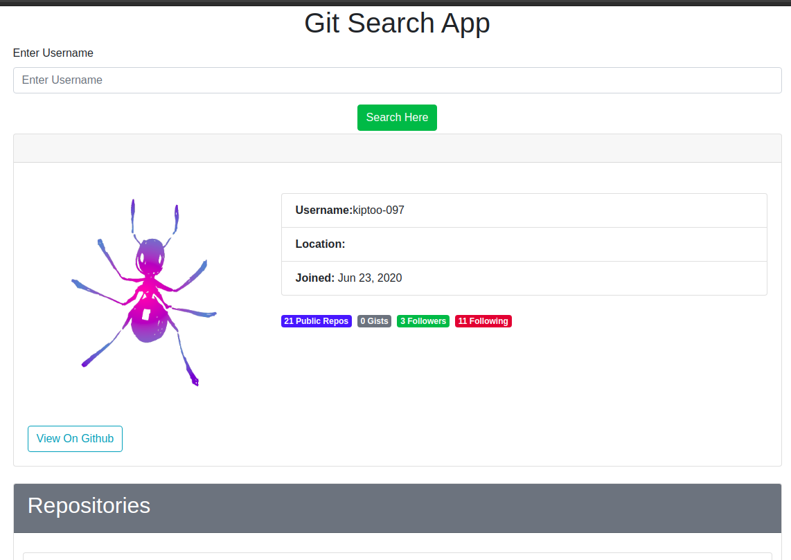

#  Github Search App
#### This Web Application helps user to search other peoples profile repositories, followers date the account was created and place of location in Github.

#### By **KIPTOO KENNEDY**&trade;

## Description

This project was generated with [Angular CLI](https://github.com/angular/angular-cli) version 10.

## Project live site
  This is the live .[ Click for the demo]( https://kiptoo-097.github.io/Git-search/)

  

  ## Technologies Used
* HTML-For Building Mark Up pages
* CSS-For styling User Interface
* Bootsrap-For making webpage responsive
* Angular 10;
* Typscript
* Figma- For web application Design.(https://www.figma.com/file/bD0OEBLVnII6Q2K4uL5e9E/Git-search-app?node-id=0%3A1)

## Behavior Driven Development
<table>
    <tr>
      <th>Behavior</th> 
      <th>Input</th> 
      <th>Output</th>   
    </tr>
    <tr>
        <td>on load</td>
        <td>scroll through </td>
        <td>reveals more on the repos</td>
    </tr> 
    <tr>
        <td>on search bar put a username</td>
        <td>['kiptoo-097']</td>
        <td>['the profile loads']</td>
    </tr>
    <tr>
        <td>scroll  view profile</td>
        <td>click the view profile</td>
        <td>takes your to the github profile</td>
    </tr>
    <tr>
        <td>on repos</td>
        <td>click button</td>
        <td>takes you to the repo on github</td>
    </tr>
       
</table>

## Development server

Run `ng serve` for a dev server. Navigate to `http://localhost:4200/`. The app will automatically reload if you change any of the source files.

## Code scaffolding

Run `ng generate component component-name` to generate a new component. You can also use `ng generate directive|pipe|service|class|guard|interface|enum|module`.

## Build

Run `ng build` to build the project. The build artifacts will be stored in the `dist/` directory. Use the `--prod` flag for a production build.

## Running unit tests

Run `ng test` to execute the unit tests via [Karma](https://karma-runner.github.io).

## Running end-to-end tests

Run `ng e2e` to execute the end-to-end tests via [Protractor](http://www.protractortest.org/).

## Support and contact details
contact me @ kiptoo097@gmail.com.com
### License
The project is under[MIT license](https://github.com/kiptoo-097/Git-search/blob/master/LICENSE.md)
Copyright &copy; 2020.All rigths reserved

## Further help.

To get more help on the Angular CLI use `ng help` or go check out the [Angular CLI README](https://github.com/angular/angular-cli/blob/master/README.md).